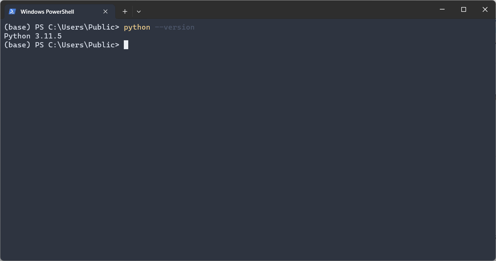

## Downloading and Installing Python

### Visit the Python Website

- Go to [Python's official website](https://www.python.org/downloads/).
- Click the download button for the latest Python version.

### Installation Process

- Open the downloaded installer.
- **Windows Users**: Check **Add Python to PATH** before clicking "Install Now".
- **macOS/Linux Users**: Follow the on-screen instructions.

### Verifying Installation

- Open the terminal or command prompt.
- Type `python --version` and press Enter.
- Confirm that the Python version number is displayed.

