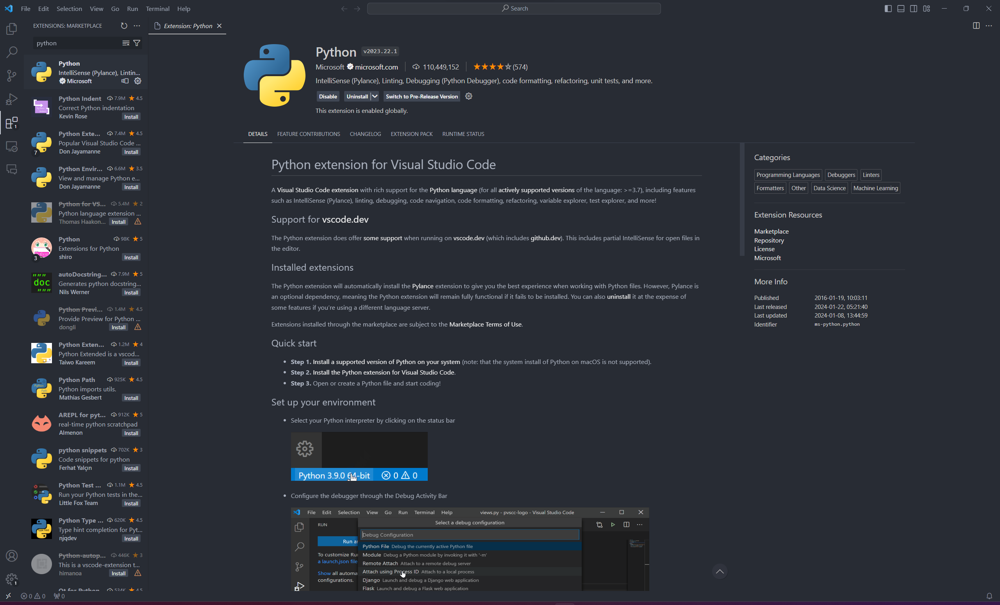

## Setting Up Visual Studio Code (VSCode) for Python Development

Visual Studio Code (VSCode) is a versatile and user-friendly code editor. In this section, we'll walk you through downloading VSCode and configuring it for Python development.

### Downloading and Installing VSCode

1. Visit the [VSCode download page](https://code.visualstudio.com/download).
2. Select the appropriate version for your operating system (Windows, macOS, or Linux) and download the installer.
3. Run the downloaded file and follow the installation prompts.

### Installing the Python Extension for VSCode

1. Once VSCode is installed, launch it.
2. To enhance VSCode for Python development, you'll need to install the Python extension. Click on the Extensions icon (or press `Ctrl+Shift+X`/`Cmd+Shift+X`).
3. In the Extensions search bar, type "Python" and look for the Python extension by Microsoft.
4. Click on the "Install" button to add this extension to VSCode.

### Configuring VSCode for Python

1. The Python extension automatically configures most settings for optimal Python development.
2. If you wish to customize further, open the Command Palette (`Ctrl+Shift+P`/`Cmd+Shift+P`) and explore Python-specific settings.

*Image Description: Screenshot of the VSCode interface, showing the Extensions screen with the Python extension by Microsoft open and ready for installation.*
