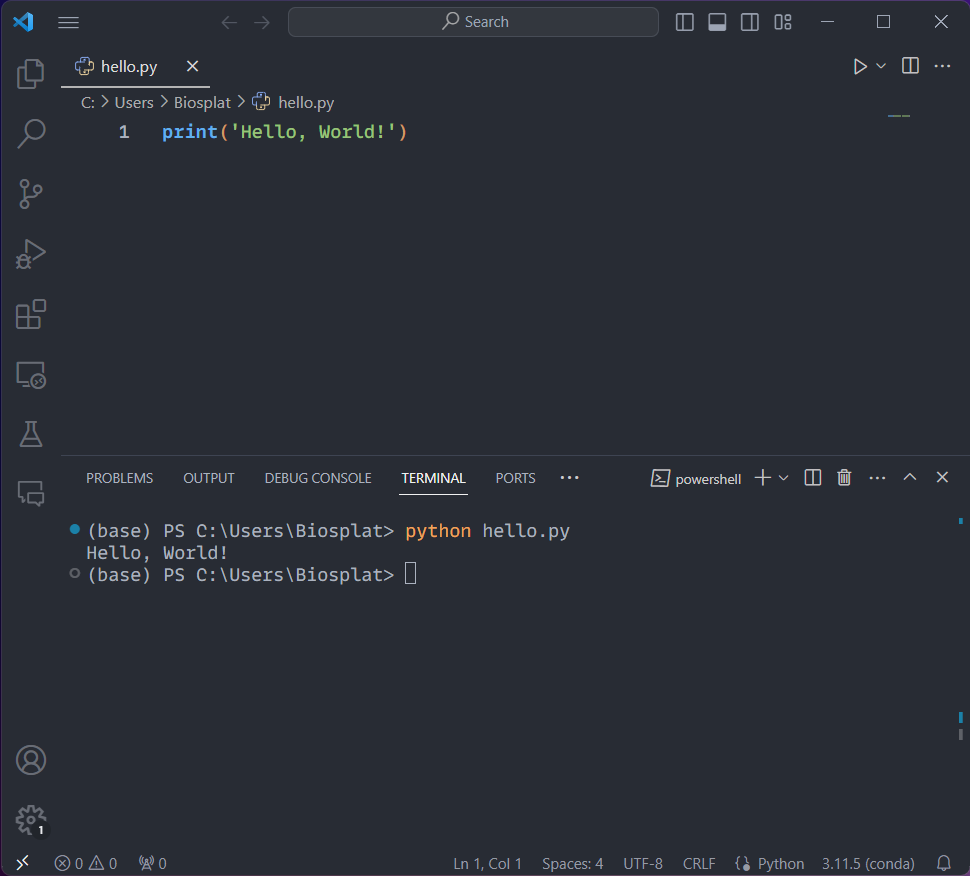

## Writing Your First Python Program in VSCode

### Creating a New Python File

- In VSCode, go to File > New File (`Ctrl+N`/`Cmd+N`).
- Save the file with a `.py` extension, e.g., `hello.py`.

### Writing the Hello World Program

Type the following code in your `hello.py` file:

```python
print("Hello, World!")
```

- Save your file (`Ctrl+S`/`Cmd+S`).

### Running the Program

- Open the integrated terminal in VSCode:
  - You can open it by going to Terminal > New Terminal from the top menu.
  - Alternatively, use the shortcut ``Ctrl+` (Windows/Linux)`` or ``Cmd+` (macOS)``.
- In the terminal, type `python hello.py` and press Enter.
- Look for the output "Hello, World!" in the terminal.


